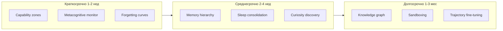

# Blueprint Integration: Полный Roadmap

## Обзор

Roadmap для поэтапной интеграции рекомендаций из blueprint в Plague InGG. Каждый шаг — конкретное действие с файлами, критериями приёмки и зависимостями.

---

# ФАЗА 1: Краткосрочная (1–2 недели)

## 1.1 Capability Zones

**Цель:** Заменить бинарный `_is_protected()` на зоны Green/Yellow/Orange/Red.

**Файлы:** [seed/tools.py](seed/tools.py), [.env.example](.env.example)

**Шаги:**

1. Добавить константы зон и маппинг путей:
   - Red: `scripts/evaluator.py`, `scripts/run_tests_runner.py`, `scripts/capability_benchmark.py`, `seed/self_improve.py`
   - Orange: `seed/tools.py` (только через add_tool с human approval)
   - Yellow: `seed/loop.py`, `seed/router.py`, `seed/llm.py`, `seed/rag.py`
   - Green: `seed/prompts/*.md`, `run.sh`, `*.md` в корне (кроме AGENT_ROADMAP)
2. Реализовать `_get_zone(path: str) -> str` вместо `_is_protected()`.
3. В `repo_patch`, `safe_edit`: Red → всегда ошибка; Orange → вернуть "Requires human approval. Use ask_human first."; Yellow/Green → разрешено.
4. В `add_tool`: Orange-операция — перед патчем вызвать `ask_human` или проверить флаг `AUTO_APPROVE_ADD_TOOL` в .env.
5. Добавить в .env.example: `# CAPABILITY_ZONES: enforce Orange=human approval. AUTO_APPROVE_ADD_TOOL=false`

**Критерии приёмки:**
- [x] `safe_edit` на evaluator.py возвращает ошибку
- [x] `add_tool` без approval возвращает сообщение о необходимости ask_human (если AUTO_APPROVE=false)
- [x] Тесты проходят

**Зависимости:** Нет. **Статус: выполнено**

---

## 1.2 Metacognitive Monitor

**Цель:** Опциональная проверка уверенности и повторений перед выполнением tool calls.

**Файлы:** [seed/loop.py](seed/loop.py), [.env.example](.env.example)

**Шаги:**

1. Добавить в .env: `METACOGNITIVE_CHECK=false` (по умолчанию выключено).
2. В `run_loop` после получения ответа с tool_calls, если `METACOGNITIVE_CHECK=true` и раунд > 3:
   - Вызвать 80B с промптом: "Оцени последний ответ ассистента: уверенность 1-5, есть ли повторения/зацикливание? Ответь JSON: {\"confidence\": N, \"repetition\": bool}."
   - Если confidence < 3 или repetition: добавить в messages user-сообщение: "Метапроверка: низкая уверенность или повторение. Перепроверь план перед выполнением."
3. Сделать вызов асинхронным/быстрым (max_tokens=50, temperature=0).

**Критерии приёмки:**
- [x] При METACOGNITIVE_CHECK=true и низкой confidence в контекст добавляется предупреждение
- [x] При false поведение без изменений
- [x] Не более +1 LLM вызова на раунд при включённом флаге

**Зависимости:** Нет. **Статус: выполнено**

---

## 1.3 Forgetting Curves

**Цель:** Взвешивание релевантности памяти по времени (Ebbinghaus-style decay).

**Файлы:** [seed/loop.py](seed/loop.py), [scripts/daily_reflection.py](scripts/daily_reflection.py), новый `seed/memory_utils.py`

**Шаги:**

1. Создать `seed/memory_utils.py`:
   - `salience(text, last_accessed_ts, base_importance=1.0, decay_factor=0.99) -> float`
   - `filter_by_salience(items: list[dict], threshold=0.3) -> list` — items с полями `content`, `timestamp`, `importance`
2. В `loop.py` при сборке контекста из working-memory/session-history: если используется RAG или chunked memory — применять salience для сортировки/фильтрации.
3. В `daily_reflection.py`: при чтении evolution-log и session-history — передавать в LLM блоки с весами (или предварительно отфильтровать низко-salience).
4. Добавить в .env: `MEMORY_DECAY_FACTOR=0.99`, `MEMORY_SALIENCE_THRESHOLD=0.3`

**Критерии приёмки:**
- [x] Старые записи (7+ дней) получают меньший вес при retrieval
- [x] Недавние записи приоритизируются
- [x] daily_reflection учитывает salience при формировании промпта

**Зависимости:** Нет. **Статус: выполнено**

---

## Чекпоинт Фазы 1

- [x] Все три задачи завершены
- [x] `uv run pytest seed/tests/ -q` — 38 passed
- [x] Обновить AGENT_ROADMAP.md — отметить Capability zones, Metacognitive, Forgetting curves как реализованные

---

# ФАЗА 2: Среднесрочная (2–4 недели)

## 2.1 Memory Hierarchy (Letta-style)

**Цель:** Core (always in context) → Recall (RAG search) → Archival (vector-only).

**Файлы:** [seed/loop.py](seed/loop.py), [seed/rag.py](seed/rag.py), [seed/prompts/ENTRY.md](seed/prompts/ENTRY.md)

**Шаги:**

1. Определить слои:
   - **Core:** identity.md (полностью) + первые 1500 символов working-memory.md. Всегда в system prompt.
   - **Recall:** session-history.md, evolution-log.md — индексировать в ChromaDB collection `recall`. При каждом запросе: семантический поиск по текущему user message, top-5 chunks.
   - **Archival:** старые сжатые сессии, knowledge — collection `knowledge` (уже есть). Только vector search.
2. В `rag.py`:
   - Добавить `recall_index(path)`, `recall_search(query, top_n=5)`.
   - Collection `recall` с теми же настройками (BGE, cosine).
3. В `loop.py`:
   - Сборка system prompt: Core (identity + working-memory prefix).
   - Перед каждым раундом: `recall_search(user_last_message)` → добавить в context как "Relevant past context".
   - Ограничить Recall: max 3000 символов из результатов.
4. Скрипт `scripts/index_recall.py`: индексировать session-history и evolution-log в recall. Запускать после сессии или по cron.

**Критерии приёмки:**
- [x] Core всегда в контексте
- [x] Recall возвращает релевантные прошлые эпизоды по запросу
- [x] Размер контекста не раздувается (лимиты соблюдены)

**Зависимости:** 1.3 (Forgetting curves) — применять salience к Recall результатам. **Статус: выполнено**

---

## 2.2 Sleep-Time Consolidation

**Цель:** Фоновый процесс, сжимающий episodic → semantic, пишет в RAG.

**Файлы:** новый [scripts/sleep_consolidation.py](scripts/sleep_consolidation.py), [seed/rag.py](seed/rag.py)

**Шаги:**

1. Создать `scripts/sleep_consolidation.py`:
   - Читает session-history, evolution-log (последние N символов).
   - Промпт LLM: "Извлеки 3–5 ключевых фактов, уроков, паттернов для долговременной памяти. Кратко, по одному предложению на пункт."
   - Результат → `rag_index` в collection `knowledge` с метаданными `source=sleep`, `timestamp=now`.
2. Добавить в `rag.py` опционально: `rag_index_text(text, metadata)` для индексации произвольного текста.
3. Запуск: cron (например, раз в 6 часов) или после daily_reflection. Добавить в README/run.sh.
4. .env: `SLEEP_CONSOLIDATION_INTERVAL=21600` (6 часов в секундах).

**Критерии приёмки:**
- [ ] Скрипт извлекает факты и индексирует в knowledge
- [ ] rag_search находит консолидированные факты
- [ ] Можно запустить вручную: `uv run python scripts/sleep_consolidation.py`

**Зависимости:** 2.1 (Recall collection должна существовать; sleep пишет в knowledge).

---

## 2.3 Curiosity-Driven Discovery

**Цель:** Discovery runner генерирует задачи на границе возможностей, интегрируется с goals.

**Файлы:** [scripts/discovery_runner.py](scripts/discovery_runner.py), [seed/tools.py](seed/tools.py) (set_goal)

**Шаги:**

1. Расширить discovery_runner:
   - Читать goals.md, evolution-log.md, data/runner/eval_result.json (если есть), capability_benchmark output.
   - Промпт: "Ты — генератор задач для self-improving агента. На основе текущих целей, evolution-log и результатов бенчмарков сгенерируй 3 задачи на границе возможностей. Задачи должны быть новыми (не из evolution-log), достижимыми, конкретными. Формат: одна задача — одна строка."
2. Результат: не только evolution_log append, но и вызов `set_goal` для 1–2 приоритетных задач (через run_loop с tools).
3. Добавить tool или внутренний вызов: `discovery_suggest_goals()` — возвращает список предложенных целей, агент может принять через set_goal.
4. Опционально: novelty score — сравнивать с уже выполненным (evolution-log) через embedding similarity, отфильтровать слишком похожие.

**Критерии приёмки:**
- [ ] Discovery генерирует задачи с учётом текущего состояния
- [ ] Задачи попадают в goals через set_goal
- [ ] evolution_log пополняется секцией "Предложенные цели"

**Зависимости:** 2.1 (Recall для чтения evolution-log в контексте discovery).

---

## Чекпоинт Фазы 2

- [ ] Memory hierarchy работает
- [ ] Sleep consolidation запускается и индексирует
- [ ] Discovery v2 генерирует и ставит цели
- [ ] Обновить AGENT_ROADMAP — Memory, Sleep, Curiosity

---

# ФАЗА 3: Долгосрочная (1–3 месяца)

## 3.1 Knowledge Graph (FalkorDBLite / Graphiti)

**Цель:** Hybrid vector + graph для Discovery, Hypothesis, AgentVersion. Временные рёбра.

**Файлы:** новый [seed/knowledge_graph.py](seed/knowledge_graph.py), [seed/rag.py](seed/rag.py), [seed/tools.py](seed/tools.py)

**Шаги:**

1. Установить `falkordblite` или `graphiti` (оценить: Graphiti — temporal KG, Zep; FalkorDBLite — проще).
2. Создать `seed/knowledge_graph.py`:
   - Схема: узлы Discovery, Hypothesis, Episode, AgentVersion.
   - Рёбра: SUPPORTS, CONTRADICTS, DERIVED_FROM, EVOLVED_INTO.
   - API: `add_discovery(content, confidence, source)`, `add_hypothesis(statement, status)`, `link_supports(a, b)`, `query_related(node_id)`.
3. Интеграция с evolution_log: при записи в evolution_log — создавать узлы Hypothesis/Episode.
4. RAG: при поиске — опционально расширять результаты через graph (соседи по рёбрам).
5. Tool: `kg_query(query)` — семантический поиск + graph traversal.

**Критерии приёмки:**
- [ ] Узлы создаются из evolution_log
- [ ] Запросы возвращают связанные гипотезы и эпизоды
- [ ] Нет падения при отсутствии БД (lazy init)

**Зависимости:** 2.1, 2.2.

---

## 3.2 Sandboxing (E2B / Firecracker)

**Цель:** shell, run_python, add_tool выполняются в изолированной среде.

**Файлы:** [seed/tools.py](seed/tools.py), новый [seed/sandbox.py](seed/sandbox.py), [.env.example](.env.example)

**Шаги:**

1. Исследовать E2B API: создание sandbox, выполнение команд, получение результата.
2. Создать `seed/sandbox.py`:
   - `run_in_sandbox(command: str, timeout: int) -> (stdout, stderr, exit_code)`
   - Опционально: копирование файлов в sandbox, обратно.
3. В tools.py: флаг `SANDBOX_SHELL=true`. Если true — shell, run_python выполняются через sandbox.
4. add_tool: при SANDBOX_ADD_TOOL=true — генерация кода и тесты в sandbox, затем применение патча на хосте только при успехе.
5. Ограничения: E2B — облачный API (cold start ~150ms). Для полностью локального — gVisor/Docker (сложнее).

**Критерии приёмки:**
- [ ] shell в sandbox не имеет доступа к .env, произвольным путям
- [ ] add_tool тестирует код в sandbox до патча
- [ ] При недоступности E2B — fallback на локальное выполнение с предупреждением

**Зависимости:** 1.1 (Capability zones).

---

## 3.3 Trajectory Fine-Tuning (DPO/GRPO)

**Цель:** Сбор trajectories, обучение LoRA на собственном опыте агента.

**Файлы:** новый `scripts/trajectory_collector.py`, `scripts/train_dpo.py`, конфиги для Unsloth/TRL

**Шаги:**

1. Trajectory collector:
   - Логировать в JSONL: (messages, tool_calls, results, outcome).
   - Формат для DPO: (prompt, chosen_response, rejected_response).
   - Хранить в data/runner/trajectories.jsonl.
2. Фильтрация: только успешные сессии (eval_result pass), разнообразие (дедупликация по embedding).
3. train_dpo.py:
   - Загрузка base model (7B–8B), QLoRA через Unsloth.
   - DPOTrainer из TRL на trajectories.
   - Сохранение LoRA адаптера.
4. Интеграция: опциональная загрузка LoRA в LLM для inference (если поддерживается).

**Критерии приёмки:**
- [ ] Trajectories собираются автоматически
- [ ] DPO training запускается на 1 GPU (RTX 4090)
- [ ] LoRA применяется к одному из LLM (например, 35B)

**Зависимости:** 2.1 (memory для контекста trajectories). Требует GPU.

---

## Чекпоинт Фазы 3

- [ ] Knowledge graph интегрирован
- [ ] Sandbox опционален и работает
- [ ] Trajectory pipeline документирован (training — отдельный run)

---

# Сводная таблица

| # | Задача | Фаза | Файлы | Оценка |
|---|--------|------|-------|--------|
| 1 | Capability zones | 1 | tools.py | 1–2 дня |
| 2 | Metacognitive monitor | 1 | loop.py | 1 день |
| 3 | Forgetting curves | 1 | memory_utils.py, loop.py, daily_reflection | 1–2 дня |
| 4 | Memory hierarchy | 2 | loop.py, rag.py, index_recall.py | 3–5 дней |
| 5 | Sleep consolidation | 2 | sleep_consolidation.py, rag.py | 2–3 дня |
| 6 | Curiosity discovery | 2 | discovery_runner.py | 2–3 дня |
| 7 | Knowledge graph | 3 | knowledge_graph.py, tools | 1–2 недели |
| 8 | Sandboxing | 3 | sandbox.py, tools.py | 1–2 недели |
| 9 | Trajectory fine-tuning | 3 | trajectory_collector, train_dpo | 2–3 недели |

---

# Что не переделывать

- Два LLM (80B + 35B) — dual-process уже реализован
- self_improve (ENTRY.md only) — до sandbox не расширять
- ChromaDB → LanceDB — опционально, низкий приоритет
